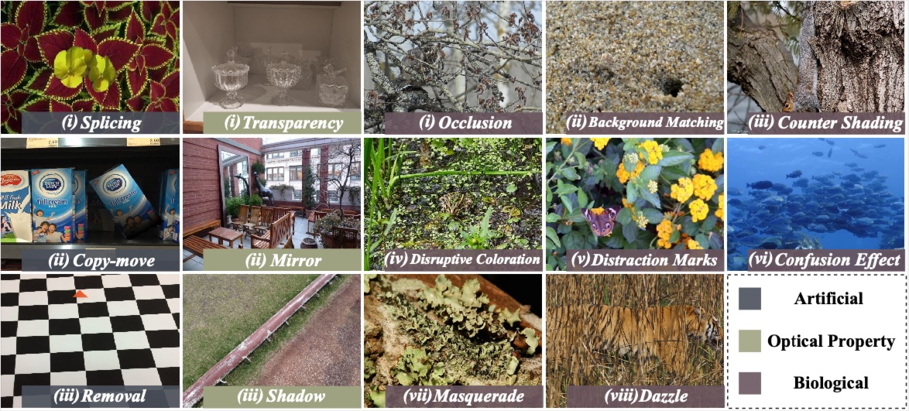

<div align=center>  </div>

*Keyworks: Concealed Visual Perception, Concealment Counteraction, Multimodal Concealment Dataset, Multimodal Large Language Model, Camouflage Object Detection, Survey, Taxnomy*

---

[**Pancheng Zhao**](https://www.zhaopancheng.top)<sup>1,2</sup>· [**Deng-Ping Fan**](https://dengpingfan.github.io/)<sup>2,1</sup> · Shupeng Cheng<sup>3</sup> · [**Peng Xu**](https://www.pengxu.net/)<sup>3</sup> · Salman Khan · Fahad Shahbaz Khan · [**Jufeng Yang**](https://cv.nankai.edu.cn/)<sup>1,2</sup>

<sup>1</sup> VCIP & TMCC & DISSec, College of Computer Science, Nankai University

<sup>2</sup> Nankai International Advanced Research Institute (SHENZHEN· FUTIAN)

<sup>3</sup> Department of Electronic Engineering, Tsinghua University

<sup>4</sup> Mohammed Bin Zayed University of Artificial Intelligence 

<sup>+</sup>corresponding authors

<a href="http://"></a>	<a href='https://zhaopancheng.top/publication'></a>

---

**Concealed Vision** consists of a series of challenging and complex tasks. The targets of these tasks cause confusion in low-level feature extraction and high-level semantic understanding by conveying limited visual information. We focus on those tasks which learns to map concealed targets in the input image to
complex output structures, called **Concealed Dense Prediction**.

- **Our Contribution.** 

  - Detailed survey for the CDP area, including analysis of 14 concealment mechanism.

    <div align=center>
    
    </div>

  - A **taxonomy of CDP** deep learning techniques in the vein of concealment counteracting.

    <div align=center>
    
    </div>

  - A large-scale multimodal instruction fine-tuning dataset in Concealed Vision area, **CvpINST**

  - An attempt at a unified paradigm in Concealed Visual Perception community, **CvpAgent**

    <div align=center>
    
    </div>

  

- **Quick View.** 

  - The following demonstrates some of the capabilities of our concealed visual perception-specific multimodal AI assistant, CvpAgent. Simply accepting pictures and user commands, the model sets multiple concealed vision tasks into one via interactive dialog.
  
    <div align=center>
    
    </div>


## 1. News

* **🔥2025-02-25🔥:** **Creating repository.** Open-source the code and dataset.


## 2. Get Start of CvpINST and CvpAgent 


#### 1. Requirements

Before running the demo, you need to install the dependencies of Qwen and SAM2.

You can install the official dependencies of them in one conda environment. 

Or install the compatible version we provide with the following steps:

```
conda create -n cvpagent python=3.10
conda activate cvpagent
# Qwen2.5 VL
pip install -r requirements.txt
pip install qwen-vl-utils
pip install git+https://github.com/huggingface/transformers.git@9d2056f12b66e64978f78a2dcb023f65b2be2108 accelerate
wget https://github.com/Dao-AILab/flash-attention/releases/download/v2.5.9.post1/flash_attn-2.5.9.post1+cu122torch2.4cxx11abiFALSE-cp310-cp310-linux_x86_64.whl
pip install flash_attn-2.5.9.post1+cu122torch2.4cxx11abiFALSE-cp310-cp310-linux_x86_64.whl
# SAM2
cd special_list/segment_anything_2
pip install -e ".[demo]"
cd ../..
```

<details>
  <summary><b>Frequently asked questions about the environment installation</b></summary>
<ol>
  <li> <b>accelerate installation failed</b></li>
    Usually it's a network problem that can be solved with a few more tries 
  <li> <b>symbol __nvJitLinkComplete_12_4 version libnvJitLink.so.12 not defined in file libnvJitLink.so.12 with link time reference</b></li>
ln -s /path/to/envs/cvpagent/lib/python3.10/site-packages/nvidia/nvjitlink/lib/libnvJitLink.so.12 /path/to/envs/cvpagent/lib/python3.10/site-packages/nvidia/cusparse/lib/libnvJitLink.so.12
<br>
export LD_LIBRARY_PATH=/path/to/envs/cvpagent/lib/python3.10/site-packages/nvidia/cusparse/lib:$LD_LIBRARY_PATH
</ol>
</details>


#### 2. Download Datasets and Checkpoints.

##### Datasets:

We collected and organized the dataset **CvpINST** from existing datasets. 

Our dataset contains **three parts**:

- **Concealed Images**: 81k+ images collected from 20 Datasets. Category labels for some of the images were manually labeled, and the data were organized in the following form:

```shell

```

- **Human-machine Dialogues:**  one-round or multi-round conversational dialogue about 4 tasks
- **Intermediate results:** Some intermediate results, including Category labels, Image Captions, Prompt templates and so on.

|        Datasets         |       GoogleDrive       |          BaiduNetdisk           |
| :---------------------: | :---------------------: | :-----------------------------: |
|    Concealed Images     | [GoogleDrive](https://) | [BaiduNetdisk](https://)(code:) |
| Human-machine Dialogues | [GoogleDrive](https://) | [BaiduNetdisk](https://)(code:) |
|  Intermediate results   | [GoogleDrive](https://) | [BaiduNetdisk](https://)(code:) |

##### Results:

The results of CDP Benchmarks can be downloaded at the following link：

|               Results               |       GoogleDrive       |          BaiduNetdisk           |
| :---------------------------------: | :---------------------: | :-----------------------------: |
| Concealed Object Segmentation Tasks | [GoogleDrive](https://) | [BaiduNetdisk](https://)(code:) |
|  Concealed Object Detection Tasks   | [GoogleDrive](https://) | [BaiduNetdisk](https://)(code:) |
|      Concealed Edge Estimation      | [GoogleDrive](https://) | [BaiduNetdisk](https://)(code:) |


##### Checkpoint:

The Official Released Models:

|     Model     |      |
| :-----------: | :--: |
|     SAM2      |      |
|  Qwen2-VL-2B  |      |
|  Qwen2-VL-7B  |      |
| Qwen2.5-VL-3B |      |
| Qwen2.5-VL-7B |      |

Our fine-tuned version

|         Model          |      |
| :--------------------: | :--: |
|  CvpAgent-Qwen2-VL-2B  |      |
|  CvpAgent-Qwen2-VL-7B  |      |
| CvpAgent-Qwen2.5-VL-3B |      |
| CvpAgent-Qwen2.5-VL-7B |      |


#### 3. Quick Demo:

You can quickly experience the model with the following commands:

~~~ 
pip install gradio
python -m src.serve.app_cvpagent \
    --model-path /path/to/finetuned/weight \
    --sam2_checkpoint /path/to/sam2/weight
~~~


#### 4. Train

##### 4.1 Finetune with LoRA

~~~
bash scripts/finetune_lora_vision.sh
~~~

##### 4.2 Merge LoRA Weights

~~~
bash scripts/merge_lora.sh
~~~


## Contact

If you have any questions, please feel free to contact me:

zhaopancheng@mail.nankai.edu.cn

pc.zhao99@gmail.com


## Citation

If you find this project useful, please consider citing:

```bibtex

```


## Acknowledgements

We gratefully acknowledge the contributions of the following projects, which served as the foundation and inspiration for our work:

- [2U1/Fine-tuning Qwen2-VL Series](https://github.com/2U1/Qwen2-VL-Finetune) 
- [facebookresearch/sam2](https://github.com/facebookresearch/sam2)
